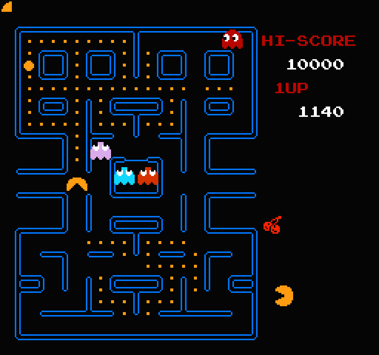
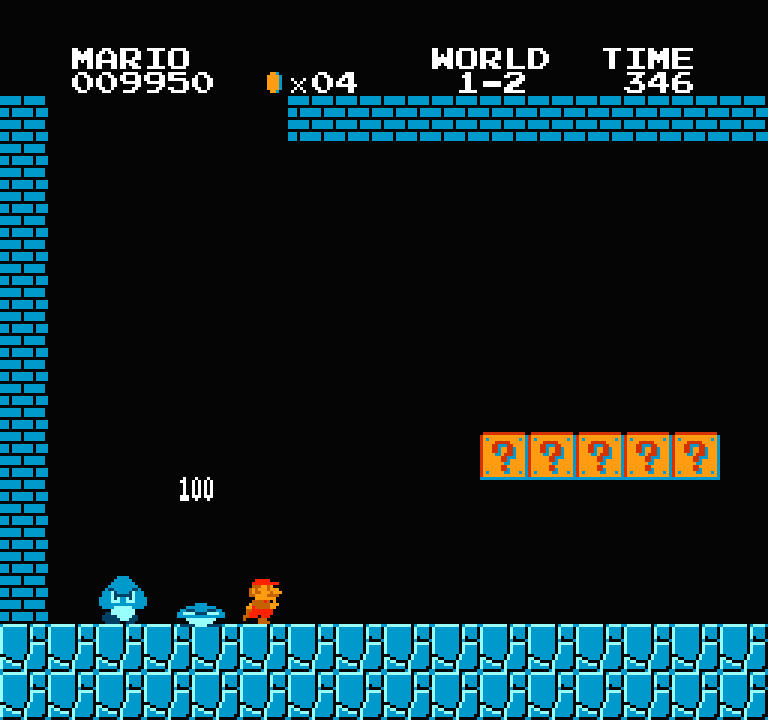

## Minimal NES Emulator

## Status
+ First-gen games such as Pacman and Super Mario Bros are playable.
+ Audio doesn't work - APU is not implemented.
+ CPU supports official and unofficial opcodes.
+ PPU is minimal, non-basic games don't work.

Bugs:
- Sprite 0 hit doesn't seem to properly work
- Sprite priority is not properly implemented

## How to run
```shell
cargo run --release -- path/to/rom.nes
```

## Screenshots
<p align="center">
  
  
</p>

## Based on
* https://www.nesdev.org
* https://www.nesdev.org/obelisk-6502-guide
* http://www.ffd2.com/fridge/docs/6502-NMOS.extra.opcodes
* https://bugzmanov.github.io/nes_ebook/index.html
* http://www.righto.com/2012/12/the-6502-overflow-flag-explained.html
* https://github.com/LucaDavidian/NES-emulator
